# PicoWRobotV1.2

**Robotics Prototyping Board for Raspberry Pi Pico W**

4 DC Motor Drivers | MPU-6050 Gyro | 16-Channel PWM | Dual USB-C Power

---

## Overview

Unlock the full potential of your Raspberry Pi Pico W with this versatile prototyping board designed specifically for fast, efficient robotics development. Perfect for hobbyists, students, and engineers, this board comes preloaded with advanced features to support even the most ambitious robotics projects.

## Key Features

| Feature | Description |
|---------|-------------|
| **4 DC Motor Drivers** | 2x TB6612FNG for controlling up to 4 DC motors with dedicated USB-C power |
| **Built-in Gyroscope** | MPU-6050 6-axis gyro and accelerometer for orientation and motion tracking |
| **16-Channel PWM Driver** | PCA9685PW for precise servo control with dedicated USB-C power |
| **Dual USB-C Power** | Ideal Diode (LM66200DRLR) for safe, independent power to motors and servos |
| **RGB LED** | Common anode LED for status indication and visual effects |
| **4 Push Buttons** | Tactile switches for real-time user input |
| **Sensor Headers** | Pre-configured headers for OLED, ultrasonic, and I2C expansion |

## Pin Diagrams

### Motor Drivers (TB6612FNG)
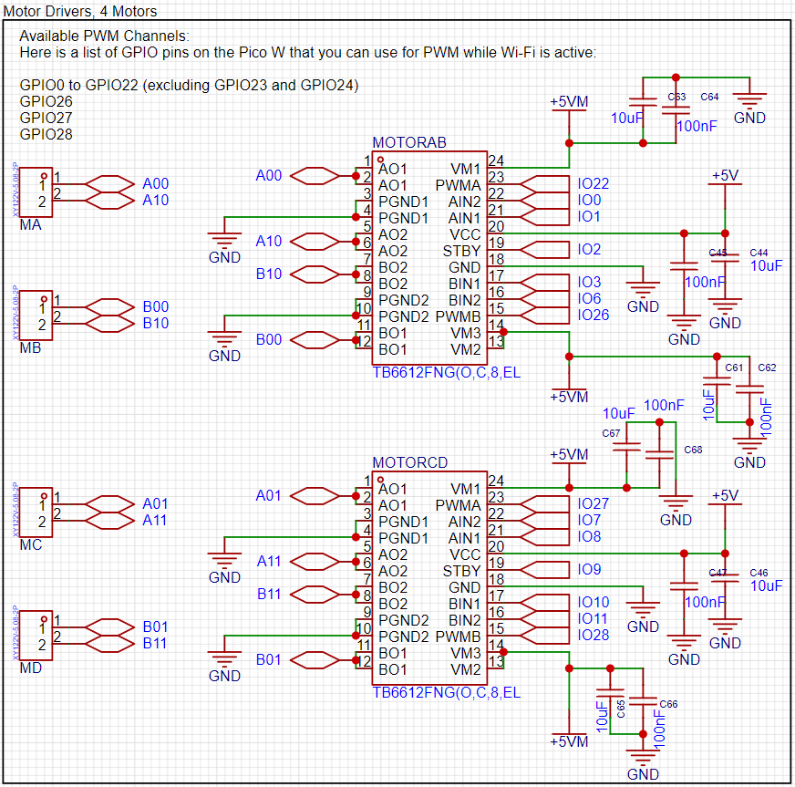

### Servo Connections (PCA9685)

  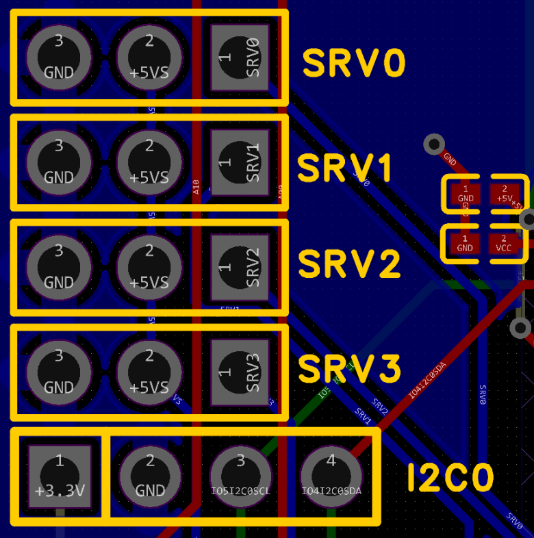
  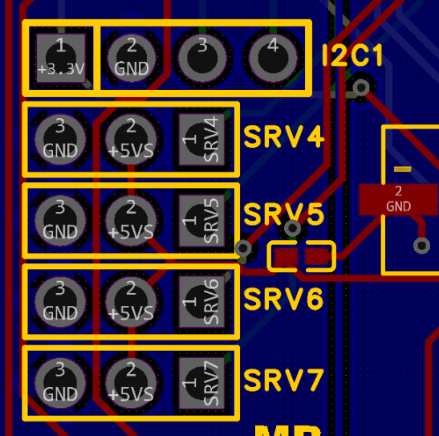
  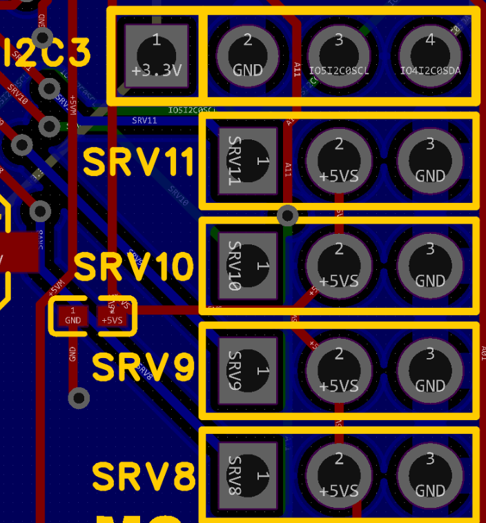
  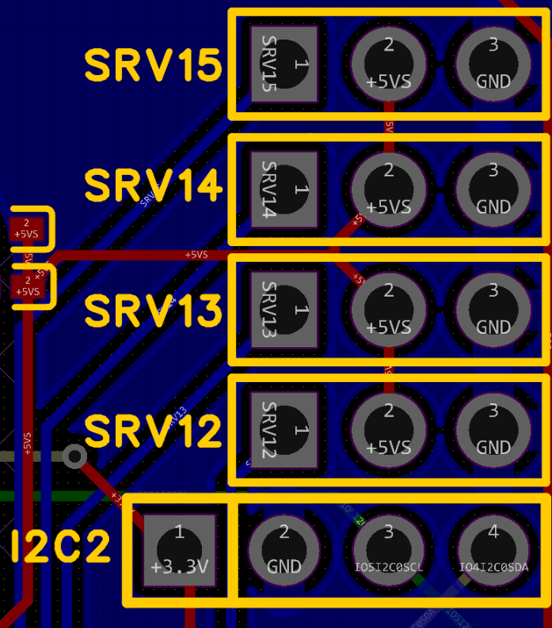

### OLED Display
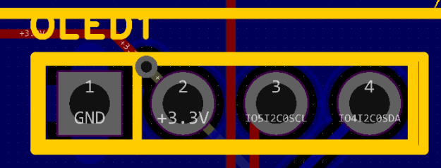

### Ultrasonic Sensor (HC-SR04)

  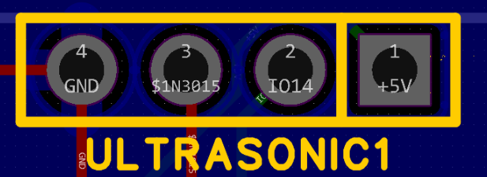
  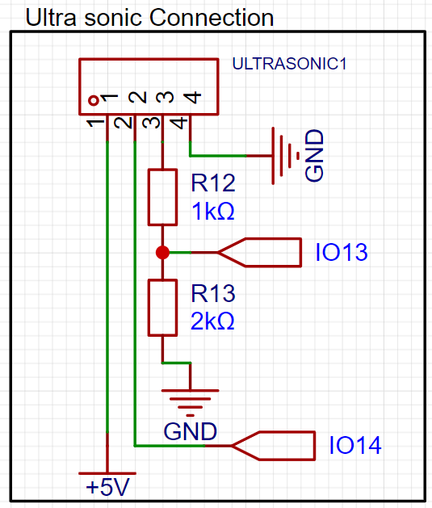

### Temperature & Humidity Sensor (DHT22)

  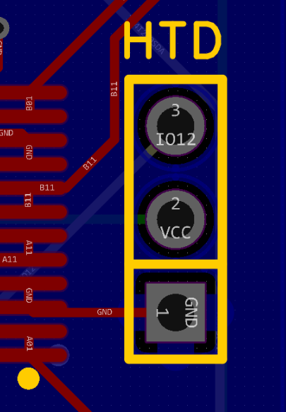
  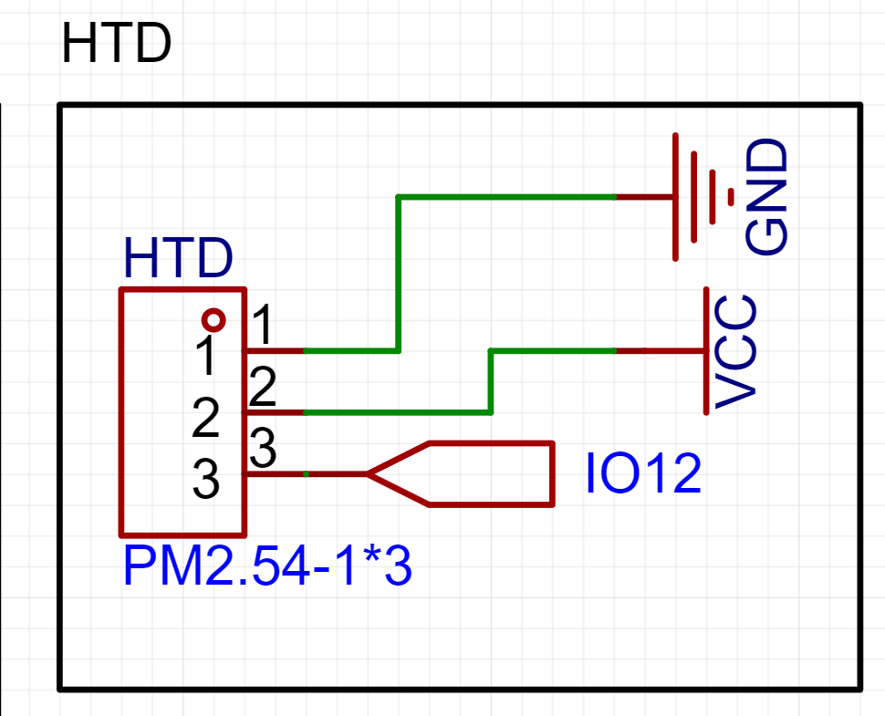

### RGB LED & Switches
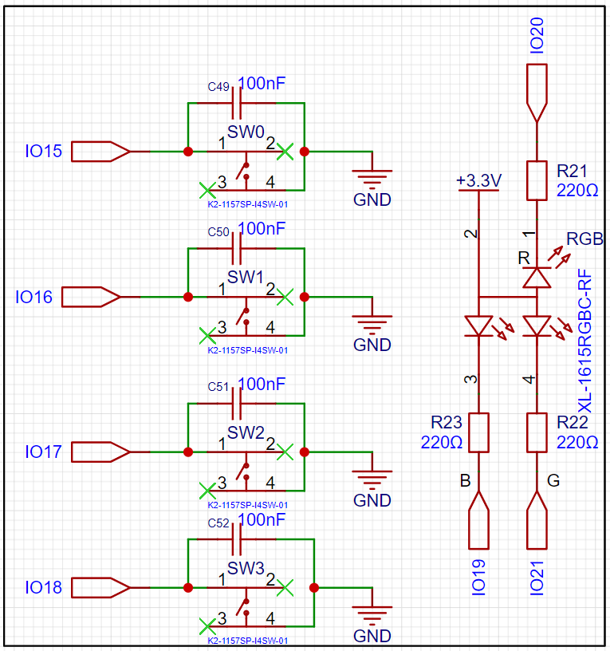

## Dimensions

| Measurement | Value |
|-------------|-------|
| PCB Size | 70.7mm x 110mm |
| PCB Weight | 58g (0.13 lbs) |
| Package Size | 20cm x 11cm x 13.5cm |
| Package Weight | 474g (1.05 lbs) |

## Bill of Materials

| # | Item | Description | Qty |
|---|------|-------------|-----|
| 1 | PicoWRobotV1.2 Board | Main prototyping board with motor drivers, gyro, PWM | 1 |
| 2 | RP Pico W | Raspberry Pi Pico W with pre-installed header pins | 1 |
| 3 | Ultrasonic Module | HC-SR04 distance sensor | 1 |
| 4 | TT Motor | DC motors for drive system | 4 |
| 5 | Mecanum Wheels | Omni-directional wheels with extensions and screws (2L, 2R) | 4 |
| 6 | DHT22 | Temperature and humidity sensor | 1 |
| 7 | OLED | 128x64 pixel display module | 1 |
| 8 | 3D Printed Body | Chassis (STL file: `PicoWv1.stl`) | 1 |
| 9 | USB-C to USB Cable | For powering the board | 2 |
| 10 | USB to Micro USB Cable | For programming the Pico W | 1 |
| 11 | Zip Ties | For securing components and power bank | 5 |
| 12 | M3 Plastic Screws | With nuts for assembly | 3 |

## Getting Started

### Requirements
- Arduino IDE
- Power bank (not included) - must use standard USB output and be narrower than 6.5cm

### Arduino Libraries
Install via Library Manager:
- Adafruit GFX Library
- Adafruit SSD1306
- Adafruit MPU6050
- Adafruit PWM Servo Driver Library
- DHT sensor library

### Upload
1. Open `PicoWSpider.ino` in Arduino IDE
2. Select Board: **Raspberry Pi Pico W**
3. Connect via USB and upload

### WiFi Control
The robot creates a WiFi access point on boot:
- **SSID:** PicoW
- **Password:** 12345678
- **Control Interface:** Connect and navigate to the IP shown on the OLED display

## 3D Model

The chassis STL file (`PicoWv1.stl`) is included for 3D printing your own robot body.

## Author

**Hasan Ismail**

I'm a passionate hobbyist who loves creating and building projects, especially in robotics. My goal with this development board is to make it as fast and easy as possible for anyone to start coding and experimenting with robotics.

Your feedback and suggestions are welcome for future versions!

Contact: [eng.hasan.m@gmail.com](mailto:eng.hasan.m@gmail.com)
